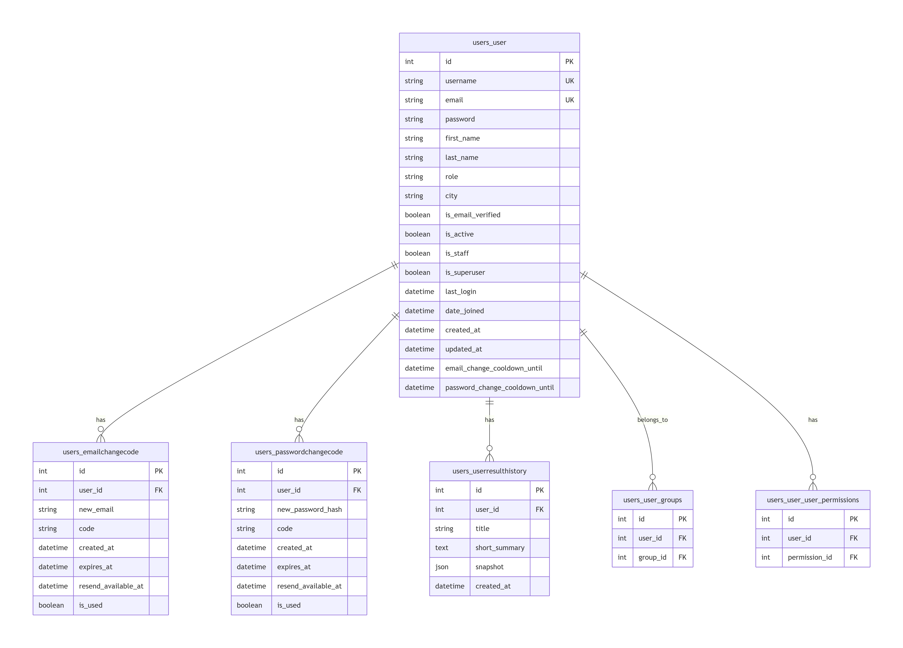

# PersonVille || team 3
[](https://gitlab.crja72.ru/django/2026/spring/course/projects/team-3/-/commits/main)

[](https://www.djangoproject.com/)
[](https://www.python.org/)
[](https://getbootstrap.com/)


**PersonVille** — психологическая игра-тест, основанная на модели личности «Большая пятёрка». Пользователь проходит тест, получает профиль характера и строит свой уникальный город, где каждая улица отражает определённую черту личности.
## Основные возможности

- Интерактивный психологический тест (15 вопросов)
- Определение черт характера на основе ответов
- Построение персонального города с улицами и домами
- Итоговый персонаж с описанием характера
- Экспорт результата в PNG-карточку
- Регистрация и авторизация пользователей

---
## Быстрый старт
### Предварительные требования

- Python 3.10 или выше
- pip
- Git

### Установка


#### 1. Клонируйте репозиторий
```bash
git clone https://gitlab.crja72.ru/django/2026/spring/course/projects/team-3
```
2. Перейдите в папку проекта
```bash
cd team-3
```
3. Создайте виртуальное окружение
```bash
python -m venv venv
```
4. Активируйте виртуальное окружение
Windows (Command Prompt):

```cmd
venv\Scripts\activate
```
Windows (PowerShell):

```powershell
.\venv\Scripts\Activate.ps1
```
macOS / Linux:

```bash
source venv/bin/activate
```
5. Установите зависимости
```bash
pip install -r requirements/dev.txt
```
6. Создайте файл .env
```bash
cp .env.example .env
```
Отредактируйте .env, укажите свой DJANGO_SECRET_KEY.
7. Примените миграции
```bash
python manage.py migrate
```
8. Создайте суперпользователя
```bash
python manage.py createsuperuser
```
9. Запустите сервер разработки
```bash
python manage.py runserver
```
Откройте http://localhost:8000 в браузере.

---

## Игровой процесс
**1. Входной тест**

Пользователь отвечает на 15 вопросов, оценивая утверждения по шкале от 1 до 5.

**2. Построение города**

На основе ответов формируется профиль по 5 чертам личности (модель «Большая пятёрка»):
- Экстраверсия (Extraversion)
- Доброжелательность (Agreeableness)
- Добросовестность (Conscientiousness)
- Нейротизм (Negative Emotionality)
- Открытость опыту (Openness)
Каждая черта получает уровень: low, mid или high.

**3. Улицы и дома**

Для каждой черты создаётся улица с тремя домами. Каждый дом содержит уточняющее утверждение, которое пользователь может принять или отвергнуть.

**4. Итоговый персонаж**

После прохождения всех улиц формируется итоговый персонаж с описанием характера, который можно скачать в виде PNG-карточки.

---
## Структура проекта
```
team-3/
├── city/                    # Логика города, улиц, домов
├── core/                    # Базовые модели
├── homepage/                # Главная страница
├── person_ville/            # Настройки проекта
├── quizzes/                 # Логика тестов
├── users/                   # Кастомная модель пользователя
├── static_dev/              # Статика (CSS, JS, изображения)
├── templates/               # HTML-шаблоны
├── requirements/            # Зависимости
├── .env.example             # Пример переменных окружения
├── .flake8                  # Конфигурация линтера
├── .gitignore
├── manage.py
└── README.md
```

---

## Схема базы данных



---

---

### Разработчики

Студенты:
```
Светлана Зурова
Максим Чернов
Дмитрий Севостьянов
```

Курс: Django-разработка, 2026

---