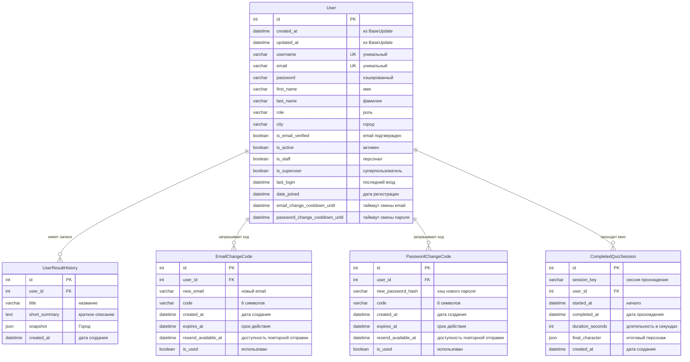

# PersonVille || team 3
[](https://gitlab.crja72.ru/django/2026/spring/course/projects/team-3/-/commits/main)

[](https://www.djangoproject.com/)
[](https://www.python.org/)
[](https://git-scm.com/)

**PersonVille** — психологическая игра-тест, основанная на модели личности «Большая пятёрка».
Пользователь проходит входной тест, получает профиль по пяти чертам личности и строит свой персональный город, где каждая улица отражает одну из характеристик.

## Основные возможности

- входной психологический тест из 15 вопросов
- определение профиля личности по модели Big Five
- построение персонального города с 5 улицами
- уточняющие вопросы по домам на каждой улице
- итоговый профиль PersonVille с описанием характера
- история зафиксированных прохождений
- смена email по коду подтверждения
- смена пароля по коду подтверждения
- регистрация, авторизация и подтверждение email
- административная панель Django

---

### Предварительные требования

- Python 3.11+
- Git

### Установка и запуск

1. Клонируйте репозиторий

```bash
git clone https://gitlab.crja72.ru/django/2026/spring/course/projects/team-3.git
```

2. Перейдите в папку проекта

```bash
cd team-3
```

3. Создайте виртуальное окружение

Linux/macOS

```bash
python3 -m venv venv
```

Windows (PowerShell)

```Power Shell
python -m venv venv
```

4. Активируйте виртуальное окружение

Linux/macOS

```bash
source venv/bin/activate
```

Windows (PowerShell)

```Power Shell
.\venv\Scripts\Activate.ps1
```

5. Установите зависимости

Для запуска проекта

```bash
pip install -r requirements/prod.txt
```

6. Настройте переменные окружения

Linux/macOS

```bash
cp .env.example .env
```

Windows (PowerShell)

```Power Shell
Copy-Item .env.example .env
```

7. Примените миграции

```bash
python manage.py migrate
```

8. Создайте суперпользователя

```bash
python manage.py createsuperuser
```

9. Запустите сервер разработки

```bash
python manage.py runserver
```

---
После запуска сервер будет доступен по адресу:

- Сайт: http://127.0.0.1:8000/

- Админка: http://127.0.0.1:8000/admin/

---

#### Игровой процесс

**1. Входной тест**

Пользователь проходит тест из 15 вопросов. На каждый вопрос выбирается один из 5 вариантов ответа — от «совсем не похоже» до «очень похоже».

**2. Построение города**

На основе ответов формируется профиль по 5 чертам личности:
- Экстраверсия
- Доброжелательность
- Добросовестность
- Негативная эмоциональность
- Открытость опыту

Для каждой черты определяется один из уровней: low, mid или high.

**3. Улицы и дома**

Каждая черта превращается в отдельную улицу. На улице расположены 3 дома, внутри которых находятся уточняющие тезисы. Ответы на них помогают глубже раскрыть характер пользователя.

**4. Итог PersonVille**

После завершения всех улиц город можно зафиксировать. Пользователь получает итоговый образ PersonVille с кратким и полным описанием результата.

**5. История прохождений**

После фиксации результат сохраняется в историю пользователя. Для каждого прохождения доступны:
- дата и время
- краткий итог
- полный итог
- ответы входного теста
- ответы по улицам и домам

---

#### Установка зависимостей

Для разработки

```bash
pip install -r requirements/dev.txt
```

Для запуска тестов

```bash
pip install -r requirements/test.txt
```

---

#### Запуск тестов

Проверка flake8

```bash
flake8
```

Проверка black

```bash
black --check .
```

Тесты Django
```bash
python3 manage.py test
```

---

###### Структура проекта
```
team-3/
├── person_ville/                # Основная директория проекта
│   ├── analytics/               # Сбор статистики
│   ├── city/                    # Логика города
│   ├── core/                    # Базовые модели
│   ├── homepage/                # Главная страница
│   ├── quizzes/                 # Логика тестов
│   ├── users/                   # Модель пользователя
│   ├── static_dev/              # Статика для разработки
│   ├── templates/               # HTML-шаблоны
│   ├── manage.py
├── requirements/                # Зависимости
├── .env.example                 # Пример переменных окружения
├── .flake8
├── pyproject.toml
├── .gitignore
├── .gitlab-ci.yml
└── README.md
```

---

###### Схема базы данных


---

###### Разработчики

Студенты:
```
Светлана Зурова
Максим Чернов
Дмитрий Севостьянов
```

Курс: Django-разработка, 2026

---
