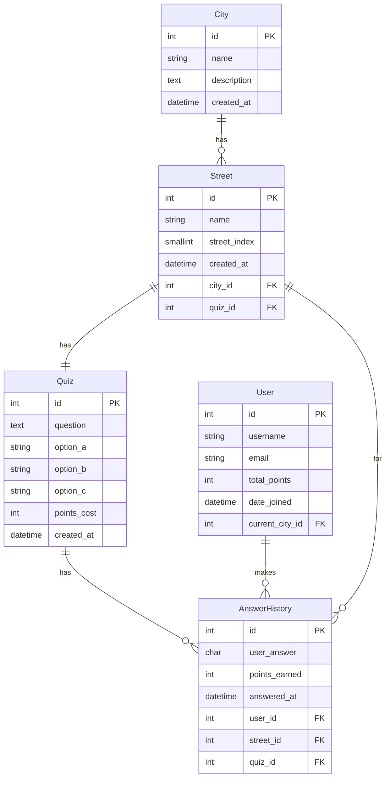

## ER-диаграмма базы данных

```mermaid
erDiagram
    City {
        int id PK
        string name
        text description
        datetime created_at
    }
    
    Street {
        int id PK
        string name
        smallint street_index
        datetime created_at
        int city_id FK
        int quiz_id FK
    }
    
    Quiz {
        int id PK
        text question
        string option_a
        string option_b
        string option_c
        int points_cost
        datetime created_at
    }
    
    AnswerHistory {
        int id PK
        char user_answer
        int points_earned
        datetime answered_at
        int user_id FK
        int street_id FK
        int quiz_id FK
    }
    
    User {
        int id PK
        string username
        string email
        int total_points
        datetime date_joined
        int current_city_id FK
    }
    
    City ||--o{ Street : "has"
    Street ||--|| Quiz : "has"
    Quiz ||--o{ AnswerHistory : "has"
    User ||--o{ AnswerHistory : "makes"
    Street ||--o{ AnswerHistory : "for"
```