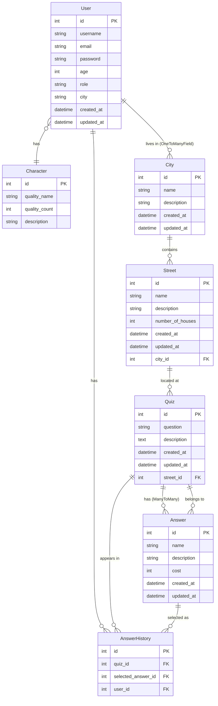

## ER-диаграмма базы данных

```mermaid
erDiagram
    User {
        int id PK
        string username
        string email
        string password
        int age
        string role
        string city
        datetime created_at
        datetime updated_at
    }
    
    Character {
        int id PK
        string quality_name
        int quality_count
        string description
    }
    
    City {
        int id PK
        string name
        string description
        datetime created_at
        datetime updated_at
    }
    
    Street {
        int id PK
        string name
        string description
        int number_of_houses
        datetime created_at
        datetime updated_at
        int city_id FK
    }
    
    Quiz {
        int id PK
        string question
        text description
        datetime created_at
        datetime updated_at
        int street_id FK
    }
    
    Answer {
        int id PK
        string name
        string description
        int cost
        datetime created_at
        datetime updated_at
    }
    
    AnswerHistory {
        int id PK
        int quiz_id FK
        int selected_answer_id FK
        int user_id FK
    }
    
    %% Relationships
    User ||--o{ AnswerHistory : "has"
    Quiz ||--o{ AnswerHistory : "appears in"
    Answer ||--o{ AnswerHistory : "selected as"
    
    User }o--|| Character : "has"
    User ||--o{ City : "lives in (OneToManyField)" 
    City ||--o{ Street : "contains"
    Street ||--o{ Quiz : "located at"
    Quiz ||--o{ Answer : "has (ManyToMany)"
    Answer }o--|| Quiz : "belongs to"
```